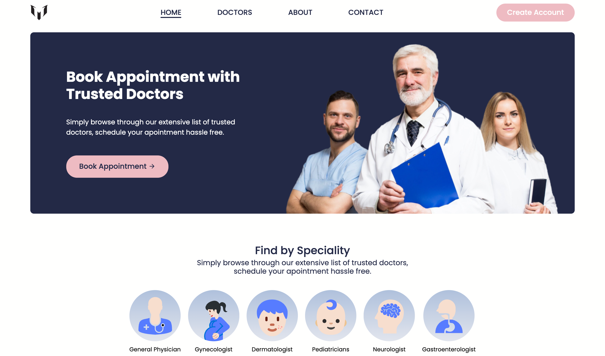

# Doctor Apointment Website
A small multipage website where you can discover doctors and book a appointment.

## functions
- booking
- multipage
- login / signup page
- catalog
- contacts
- about
- footer
- navbar
- animations
- responsive (pretty much)
- have individual doctors page
- can select date and time

## View site
- search [pulga.rojen.name.np](https://la-pulga.netlify.app/)

or
- clone the repo from my [github](https://github.com/rojen-chakradhar/Doctor-Appointment-Website)

###### Github Copilot was used to make this. I did ask chatgpt for how to make filter for catalog, but i didnt use it. and i asked how to make the login/signup work but it also couldnt make it work. But copilot helped me understand the booking function and we both made it.